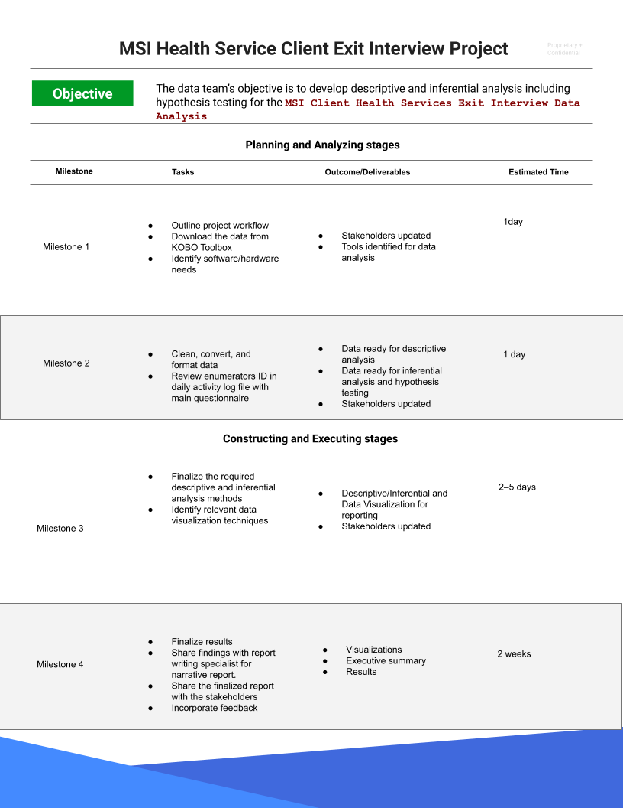

# MSI Client Health Services Client Exit Analysis Project's PACE Framework

## 1. Plan
### Tasks:
#### 1. Research Business Data:
- Understand the MSI Client Exit Interview survey structure, purpose, and the orgnization's key goals.
- Identify the critical indicators of client satisfaction and service effectiveness.
- Research similar healthcare survey projects to gather best practices for data analysis and visualization.
#### 2. Define Project Scope:

- Focus on assessing client satisfaction, service accessibility, and the effectiveness of contraceptive counseling and education.
- Include tasks such as cleaning survey data, performing descriptive and inferential analyses, and creating visualizations.
- Exclude areas beyond survey data analysis, such as operational efficiency or internal staff evaluations.
Develop Workflows:

#### 3. Data Collection Workflow: Import raw survey data from the source.
- ***Data Preparation Workflow:*** Clean and standardize the data.
- ***Analysis Workflow:*** Conduct EDA, visualization, and inferential analyses.
- ***Reporting Workflow:*** Generate reports and visualizations for stakeholders.
- Tool Selection: Use tools like Python (pandas, matplotlib, seaborn), Jupyter Notebooks, and GitHub for version control.

#### 4. Assess Stakeholder Needs:

- Meet with stakeholders (e.g., healthcare providers, management, and funders) to understand their priorities.
- Identify key questions they want answered (e.g., "Which regions have the lowest satisfaction?" "Are there specific services that need improvement?").
- Gather feedback on reporting formats and visualization preferences.
Summary:

### Summary: 
- Conceptualization: This project aims to analyze the MSI Client Exit Interview data to evaluate client satisfaction and identify actionable insights for improving healthcare services. 
- Establish clear workflows, stakeholder alignment, and tool selection to ensure project success.

## 2. Analyze
Objective: Collect, clean, and prepare data for use.

### Tasks:
#### 1. Format Databases:

- Organize survey responses into a structured format (e.g., CSV or Excel).
- Use descriptive variable names that align with the questionnaire (e.g., SatisfactionScore, ServiceType).
- Handle any multi-choice responses by converting them into binary or categorical columns.

#### 2. Scrub Data:

- Identify and handle missing values (e.g., replace 999 and 888 codes with NaN or specific placeholders).
- Correct inconsistencies in responses (e.g., mismatches between skip logic and recorded data).
- Remove duplicates and validate ranges for numerical variables (e.g., ensuring satisfaction scores are between 0-10).

#### 3. Convert Data into Usable Formats:

- Normalize textual data for analysis (e.g., lowercase conversion, removing leading/trailing spaces).
- Encode categorical variables using one-hot encoding or label encoding.
- Create derived variables for easier analysis, such as aggregating regional satisfaction averages.

#### Summary:
- EDA Process: Inspect distributions of key variables (e.g., satisfaction scores, demographic data).
Visualize patterns and identify anomalies in the data.
- Document findings to inform further analysis.
- Outcome: A cleaned and structured dataset ready for advanced analysis and visualization.

